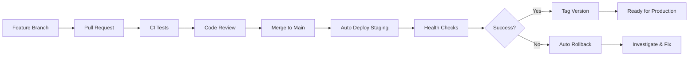

# 🚀 Déploiement Automatique Staging

## 📋 Vue d'ensemble

Ce document décrit le processus de déploiement automatique en environnement staging pour l'application Agence Immobilière.

## 🎯 Objectifs

- Déploiement automatique après chaque merge sur `main`
- Environnement de test proche de la production
- Variables d'environnement sécurisées
- Migrations automatiques de base de données
- Capacité de rollback

## 🏗️ Architecture Staging

### Backend
- **Plateforme**: Azure App Service
- **Runtime**: Node.js 20.x
- **Base de données**: MongoDB Atlas (cluster staging)
- **URL**: https://agence-immobiliere-staging.azurewebsites.net

### Frontend
- **Plateforme**: Azure Static Web Apps
- **Framework**: Next.js 16
- **URL**: Configurée dans les secrets GitHub

## 🔐 Configuration des Secrets GitHub

### Secrets Requis

Aller dans `Settings` → `Secrets and variables` → `Actions` et ajouter:

#### Credentials Azure
```
AZURE_CREDENTIALS
```
Format JSON:
```json
{
  "clientId": "xxx",
  "clientSecret": "xxx",
  "subscriptionId": "xxx",
  "tenantId": "xxx"
}
```

#### Configuration Backend
```
STAGING_BACKEND_APP_NAME          # Nom de l'App Service backend
STAGING_MONGODB_URI               # URI MongoDB staging
STAGING_JWT_SECRET                # Secret JWT (min 32 caractères)
STAGING_SESSION_SECRET            # Secret session (min 32 caractères)
STAGING_GOOGLE_CLIENT_ID          # Google OAuth Client ID
STAGING_GOOGLE_CLIENT_SECRET      # Google OAuth Client Secret
STAGING_API_URL                   # URL complète de l'API staging
```

#### Configuration Frontend
```
STAGING_FRONTEND_URL              # URL du frontend staging
STAGING_STATIC_WEB_APP_TOKEN      # Token Azure Static Web Apps
```

#### Configuration Générale
```
AZURE_RESOURCE_GROUP              # Nom du resource group Azure
```

## 🚦 Déclencheurs de Déploiement

### Automatique
Le déploiement se déclenche automatiquement :
- ✅ Après un `push` sur la branche `main`
- ✅ Après un merge d'une Pull Request vers `main`

### Manuel
Le déploiement peut être déclenché manuellement :
1. Aller dans `Actions` → `Staging Deployment`
2. Cliquer sur `Run workflow`
3. Sélectionner la branche `main`
4. Cliquer sur `Run workflow`

## 📊 Pipeline de Déploiement

### Étape 1: Build & Test
```
1. Checkout du code
2. Installation des dépendances
3. Exécution des tests backend
4. Build du frontend
5. Création des artifacts
```

### Étape 2: Déploiement Backend
```
1. Téléchargement de l'artifact backend
2. Connexion à Azure
3. Déploiement sur App Service
4. Configuration des variables d'environnement
5. Exécution des migrations
6. Redémarrage de l'application
```

### Étape 3: Déploiement Frontend
```
1. Checkout du code
2. Build avec configuration staging
3. Connexion à Azure
4. Déploiement sur Static Web Apps
```

### Étape 4: Health Check
```
1. Vérification backend (/health)
2. Vérification frontend (page d'accueil)
3. Test de l'API (/api)
```

### Étape 5: Notification & Tagging
```
1. Création du résumé de déploiement
2. Création d'un tag de version
3. Notification du statut
```

## 🗄️ Migrations de Base de Données

### Configuration

Les migrations s'exécutent automatiquement après le déploiement backend.

### Créer une migration

1. Créer un script dans `backend/migrations/`:
```javascript
// backend/migrations/20250102_add_user_field.js
module.exports = {
  async up(db) {
    // Code de migration
    await db.collection('users').updateMany(
      {},
      { $set: { newField: 'defaultValue' } }
    );
  },
  
  async down(db) {
    // Code de rollback
    await db.collection('users').updateMany(
      {},
      { $unset: { newField: '' } }
    );
  }
};
```

2. Les migrations sont appliquées automatiquement lors du déploiement

### Rollback manuel de migration

```bash
# Se connecter au backend staging
az webapp ssh --name <STAGING_BACKEND_APP_NAME> --resource-group <AZURE_RESOURCE_GROUP>

# Exécuter le rollback
npm run migrate:down
```

## 🔄 Processus de Rollback

### Rollback Automatique

Un rollback automatique est déclenché si:
- Les health checks échouent après déploiement
- Une erreur critique est détectée

### Rollback Manuel

1. **Identifier le tag de version à restaurer**:
   ```bash
   git tag -l "staging-*"
   ```

2. **Déclencher le rollback**:
   - Aller dans `Actions` → `Rollback Staging`
   - Cliquer sur `Run workflow`
   - Entrer le tag de version (ex: `staging-20250102-143000`)
   - Entrer la raison du rollback
   - Cliquer sur `Run workflow`

3. **Le workflow effectue**:
   - ✅ Validation du tag
   - ✅ Backup de l'état actuel
   - ✅ Rollback backend
   - ✅ Rollback frontend
   - ✅ Vérification post-rollback

### Tags de Version

Format: `staging-YYYYMMDD-HHMMSS`

Exemple: `staging-20250102-143045`

Chaque déploiement réussi crée un tag automatiquement pour faciliter les rollbacks.

## 🧪 Tests Post-Déploiement

### Health Checks Automatiques

Le pipeline vérifie automatiquement:

1. **Backend Health**:
   ```bash
   curl https://agence-immobiliere-staging.azurewebsites.net/health
   # Attendu: HTTP 200 avec { "status": "OK" }
   ```

2. **Frontend**:
   ```bash
   curl https://<FRONTEND_URL>
   # Attendu: HTTP 200
   ```

3. **API**:
   ```bash
   curl https://agence-immobiliere-staging.azurewebsites.net/api
   # Attendu: HTTP 200 avec données JSON
   ```

### Tests Manuels

Après chaque déploiement, vérifier:
- [ ] Login avec Google OAuth
- [ ] Dashboard utilisateur
- [ ] Dashboard administrateur
- [ ] API endpoints principaux

## 📈 Monitoring

### Azure Application Insights

Le monitoring est configuré automatiquement :
- Logs applicatifs
- Métriques de performance
- Traces des requêtes
- Alertes sur erreurs

### Accéder aux logs

#### Via Azure Portal
1. Aller sur le portail Azure
2. Naviguer vers l'App Service staging
3. Aller dans `Monitoring` → `Log stream`

#### Via CLI
```bash
az webapp log tail --name <STAGING_BACKEND_APP_NAME> --resource-group <AZURE_RESOURCE_GROUP>
```

### Alertes Configurées

- ❌ Erreurs HTTP 5xx > 10/min
- ⚠️ Temps de réponse > 5 secondes
- ⚠️ CPU > 80% pendant 5 minutes
- ⚠️ Mémoire > 80% pendant 5 minutes

## 🔒 Sécurité

### Variables d'Environnement

- ✅ Toutes les secrets sont stockés dans GitHub Secrets
- ✅ Jamais de secrets en dur dans le code
- ✅ `NODE_ENV=staging` pour l'environnement staging
- ✅ Connexions HTTPS uniquement

### Base de Données

- ✅ Cluster MongoDB dédié pour staging
- ✅ Authentification requise
- ✅ IP whitelist configurée
- ✅ Backups automatiques quotidiens

### Authentification

- ✅ JWT avec secret unique pour staging
- ✅ Session secret différent de production
- ✅ Google OAuth avec credentials staging

## 🐛 Troubleshooting

### Le déploiement échoue

1. **Vérifier les secrets**:
   - Tous les secrets requis sont-ils configurés?
   - Les credentials Azure sont-ils valides?

2. **Consulter les logs**:
   - Aller dans `Actions` → Workflow échoué
   - Consulter les logs de chaque step

3. **Vérifier Azure**:
   ```bash
   az webapp show --name <STAGING_BACKEND_APP_NAME> --resource-group <AZURE_RESOURCE_GROUP>
   ```

### Health check échoue

1. **Vérifier l'application**:
   ```bash
   az webapp log tail --name <STAGING_BACKEND_APP_NAME> --resource-group <AZURE_RESOURCE_GROUP>
   ```

2. **Tester manuellement**:
   ```bash
   curl -v https://agence-immobiliere-staging.azurewebsites.net/health
   ```

3. **Redémarrer si nécessaire**:
   ```bash
   az webapp restart --name <STAGING_BACKEND_APP_NAME> --resource-group <AZURE_RESOURCE_GROUP>
   ```

### Base de données inaccessible

1. **Vérifier la connection string**:
   - Le secret `STAGING_MONGODB_URI` est-il correct?

2. **Vérifier MongoDB Atlas**:
   - Le cluster staging est-il actif?
   - L'IP d'Azure est-elle whitelistée?

3. **Tester la connexion**:
   ```bash
   # Via Azure SSH
   node -e "const mongoose = require('mongoose'); mongoose.connect(process.env.MONGODB_URI).then(() => console.log('Connected')).catch(e => console.error(e));"
   ```

## 📞 Support

### Équipe DevOps
- **Email**: devops@agence.com
- **Slack**: #devops-support

### Documentation Supplémentaire
- [Azure App Service Docs](https://docs.microsoft.com/azure/app-service/)
- [Azure Static Web Apps Docs](https://docs.microsoft.com/azure/static-web-apps/)
- [GitHub Actions Docs](https://docs.github.com/actions)

## 📝 Checklist de Configuration Initiale

- [ ] Créer les ressources Azure (App Service + Static Web App)
- [ ] Configurer MongoDB Atlas cluster staging
- [ ] Ajouter tous les secrets GitHub
- [ ] Configurer Google OAuth (credentials staging)
- [ ] Tester le déploiement manuel
- [ ] Vérifier les health checks
- [ ] Configurer les alertes Azure
- [ ] Documenter les URLs staging
- [ ] Former l'équipe sur le processus de rollback

## 🔄 Workflow de Développement



## 📅 Prochaines Étapes

- [ ] AW-22: Tests E2E automatisés
- [ ] AW-23: Monitoring et alertes avancés
- [ ] AW-24: Feature flags
- [ ] AW-25: Déploiement production
- [ ] AW-26: Retrospective DevOps
